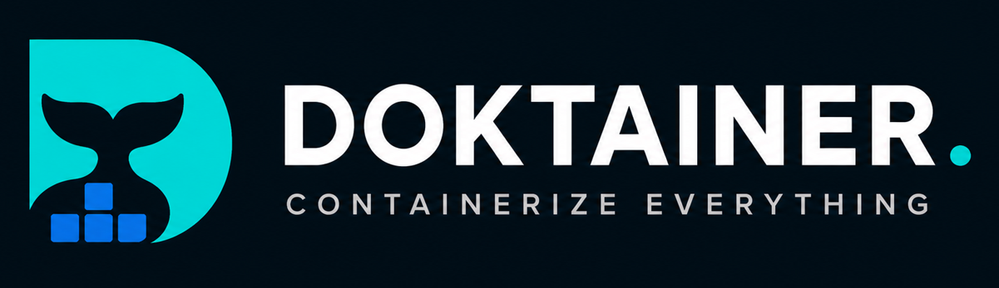

<div align="center">
  
  
# Doktainer - Kelola Docker, Sederhanakan Semuanya

[](https://github.com/DoktainerApp/doktainer/releases)<br>
[](https://discord.gg/3HF85Cd6fp)
[](https://hub.docker.com/r/doktainer/doktainer)<br>
[](https://github.com/DoktainerApp/doktainer/pkgs/container/doktainer)
[](https://github.com/DoktainerApp/doktainer/blob/main/LICENSE)

  </div>

---

## Ringkasan

Doktainer adalah platform manajemen Docker open-source dan self-hosted yang membantu Anda mengelola server, aplikasi, container, domain, SSL, backup, dan deployment dari satu antarmuka web. Dirancang untuk individu dan tim yang menginginkan kendali penuh atas infrastruktur mereka tanpa vendor lock-in.

---

## ✨ Fitur

Doktainer memiliki berbagai fitur yang bisa Anda gunakan.

- Manajemen multi-server
- Manajemen Docker & container
- Deployment aplikasi
- Manajemen domain & SSL
- Log, metrik & monitoring
- Organisasi & Role-Based Access Control (RBAC)
- API Keys
- Integrasi Git
- Integrasi backup
- Terminal bawaan
- Fastify API + Next.js frontend
- Self-hosted & Open Source

---

## Persyaratan

- Node.js 22+
- PostgreSQL 16+
- Docker Engine + Compose v2 (opsional)

---

## Mulai Cepat

Untuk memulai, jalankan perintah berikut di VPS:

```bash
curl -sSL https://doktainer.com/install.sh | sh
```

Untuk update:

```bash
curl -fsSL https://doktainer.com/install.sh | sh -s -- update
```

Untuk update spesifik versi:

```bash
curl -fsSL https://doktainer.com/install.sh | DOKTAINER_VERSION=v0.1.4 sh -s -- update
```

Atau jika menggunakan image registry:

```bash
curl -fsSL https://doktainer.com/install.sh | \
  DOKTAINER_IMAGE=ghcr.io/DoktainerApp/doktainer:v0.1.4 sh -s -- update
```

Sebelum update, sangat direkomendasikan untuk melakukan backup konfigurasi:

```bash
cp /etc/doktainer/.env.docker /etc/doktainer/.env.docker.backup
cp /etc/doktainer/docker-compose.yml /etc/doktainer/docker-compose.yml.backup
```

## Mulai Cepat (Lokal)

### Clone repositori

```bash
git clone https://github.com/DoktainerApp/doktainer.git
cd doktainer
```

### Install dependensi

```bash
npm install
```

### Konfigurasi environment

```bash
cp .env.example .env
```

### Konfigurasi database

```bash
npm run db:generate
npm run db:push
```

### Jalankan server pengembangan

```bash
npm run dev
```

Buka:

```
Frontend
http://localhost:3000

Backend
http://localhost:4000
```

---

## 🐳 Deployment Docker

Doktainer sudah mencakup semua yang diperlukan untuk deployment Docker.

```bash
docker compose up -d
```

Untuk deployment produksi, instalasi VPS, reverse proxy, SSL, dan konfigurasi runtime, silakan merujuk ke dokumentasi.

---

## 📚 Dokumentasi

Dokumentasi lengkap tersedia di

> https://docs.doktainer.com

Meliputi:

- Instalasi
- Deployment Docker
- Reverse Proxy
- Variabel Lingkungan
- Pengembangan
- API
- Pemecahan Masalah

---

## 🏗️ Arsitektur

Doktainer terdiri dari:

- **Next.js** frontend
- **Fastify** backend
- **PostgreSQL**
- **Docker Engine**

Dirancang sebagai modular monolith untuk pengalaman pengembangan yang sederhana, namun tetap memisahkan tanggung jawab frontend dan backend.

---

## 🛣️ Roadmap

- ✅ Multi Project
- ✅ Multi Server
- ✅ Manajemen Docker
- ✅ Organisasi
- ✅ Domain & SSL
- ✅ RBAC
- ✅ Terminal
- ✅ App Installer
- ✅ Template Docker Compose
- ✅ Deployment Satu-Klik
- 🚧 Docker SWARM
- 🚧 Manajemen Cluster
- 🚧 Dukungan Kubernetes

---

## 🤝 Berkontribusi

Kontribusi sangat diterima!

Baik itu memperbaiki bug, menyempurnakan dokumentasi, atau mengusulkan fitur baru, kami sangat menghargai bantuan Anda.

Silakan baca Panduan Berkontribusi sebelum membuka Pull Request.

---

## ❤️ Sponsor

Terima kasih kepada semua yang mendukung Doktainer.

| Sponsor                                    | Tipe Sponsor      |
| ------------------------------------------ | ----------------- |
| [**IDCloudhost**](https://idcloudhost.com) | Cloud Hosting     |
| [**Sumopod**](https://sumopod.com)         | Cloud Hosting     |
| [**PAAS ID**](https://paas.id)             | Cloud Hosting     |
| [**Ktikme**](https://ktik.me)              | Profile BIO-Link  |
| [**Dahono Labs**](https://labs.dahono.com) | AI Agent Services |

Tertarik menjadi sponsor Doktainer?

Bergabunglah dengan [**Komunitas Discord**](https://discord.gg/3HF85Cd6fp) kami.

---

## 📄 Lisensi

Doktainer menggunakan lisensi MIT. Lihat file `LICENSE` di root repositori untuk detail lisensi.

#### 🚫 Hanya Penggunaan Non-Komersial

Perangkat lunak ini gratis untuk digunakan, dimodifikasi, dan didistribusikan **untuk tujuan non-komersial saja**. Segala penggunaan untuk kegiatan yang menghasilkan pendapatan atau di dalam organisasi yang mencari laba sangat dilarang berdasarkan ketentuan ini.

#### 💼 Lisensi Komersial

Jika Anda ingin menggunakan Doktainer untuk tujuan komersial, operasional bisnis, atau sebagai bagian dari layanan berbayar, Anda harus memperoleh lisensi komersial terpisah. Silakan hubungi penulis untuk informasi lebih lanjut.

---

<div align="center">

Dibuat dengan ❤️ oleh KodekaTeam

</div>
