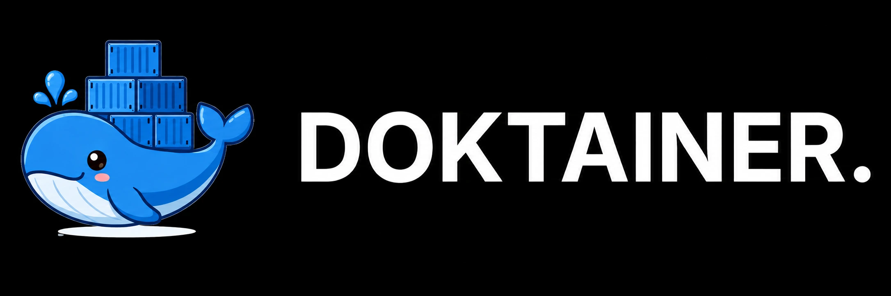

<div align="center">
  
  
# Doktainer - Manage Docker, Simplify Everything

[](https://github.com/DoktainerApp/doktainer/releases)<br>
[](https://discord.gg/3HF85Cd6fp)
[](https://hub.docker.com/r/doktainer/doktainer)<br>
[](https://github.com/DoktainerApp/doktainer/pkgs/container/doktainer)
[](https://github.com/DoktainerApp/doktainer/blob/main/LICENSE)

  </div>

---

## Overview

Doktainer is an open-source, self-hosted Docker management platform that helps you manage servers, applications, containers, domains, SSL, backups, and deployments from a single web interface. Designed for individuals and teams who want full control over their infrastructure without vendor lock-in.

---

## ✨ Features

Doktainer includes multiple features that you can use.

- Multi-server management
- Docker & container management
- Application deployment
- Domain & SSL management
- Logs, metrics & monitoring
- Organizations & Role-Based Access Control (RBAC)
- API Keys
- Git integrations
- Backup integrations
- Built-in terminal
- Fastify API + Next.js frontend
- Self-hosted & Open Source

---

## Requirements

- Node.js 22+
- PostgreSQL 16+
- Docker Engine + Compose v2 (optional)

---

## Quick Start

To get started, run the following command on a VPS:

```bash
curl -sSL https://doktainer.com/install.sh | sh
```

For Update

```bash
curl -fsSL https://doktainer.com/install.sh | sh -s -- update
```

To update to a specific version:

```bash
curl -fsSL https://doktainer.com/install.sh | DOKTAINER_VERSION=v0.1.4 sh -s -- update
```

Or if using a dedicated image registry:

```bash
curl -fsSL https://doktainer.com/install.sh | \
  DOKTAINER_IMAGE=ghcr.io/organisasi/doktainer:v0.1.4 sh -s -- update
```

Before updating, it is recommended to back up the configuration:

```bash
cp /etc/doktainer/.env.docker /etc/doktainer/.env.docker.backup
cp /etc/doktainer/docker-compose.yml /etc/doktainer/docker-compose.yml.backup
```

## Local Quick Start

### Clone the repository

```bash
git clone https://github.com/DoktainerApp/doktainer.git
cd doktainer
```

### Install dependencies

```bash
npm install
```

### Configure environment

```bash
cp .env.example .env
```

### Prepare the database

```bash
npm run db:generate
npm run db:push
```

### Start development

```bash
npm run dev
```

Open:

```
Frontend
http://localhost:3000

Backend
http://localhost:4000
```

---

## 🐳 Docker Deployment

Doktainer includes everything needed for Docker deployment.

```bash
docker compose up -d
```

For production deployments, VPS installation, reverse proxy, SSL, and runtime configuration, please refer to the documentation.

---

## 📚 Documentation

Complete documentation is available at

> https://docs.doktainer.com

Including:

- Installation
- Docker Deployment
- Reverse Proxy
- Environment Variables
- Development
- API
- Troubleshooting

---

## 🏗️ Architecture

Doktainer consists of:

- **Next.js** frontend
- **Fastify** backend
- **PostgreSQL**
- **Docker Engine**

Designed as a modular monolith for a simple development experience while keeping frontend and backend responsibilities separated.

---

## 🛣️ Roadmap

- ✅ Multi Project
- ✅ Multi Server
- ✅ Docker Management
- ✅ Organizations
- ✅ Domains & SSL
- ✅ RBAC
- ✅ Terminal
- ✅ App Installer
- ✅ Docker Compose Templates
- ✅ One-Click Deployments
- 🚧 Docker SWARM
- 🚧 Cluster Management
- 🚧 Kubernetes Support

---

## 🤝 Contributing

Contributions are welcome!

Whether it's fixing bugs, improving documentation, or proposing new features, we'd love to have your help.

Please read our Contributing Guide before opening a Pull Request.

---

## ❤️ Sponsors

Thanks to everyone supporting Doktainer.

| Sponsor                                    | Sponsor Type      |
| ------------------------------------------ | ----------------- |
| [**IDCloudhost**](https://idcloudhost.com) | Cloud Hosting     |
| [**Sumopod**](https://sumopod.com)         | Cloud Hosting     |
| [**PAAS ID**](https://paas.id)             | Cloud Hosting     |
| [**Ktikme**](https://ktik.me)              | Profile BIO-Link  |
| [**Dahono Labs**](https://labs.dahono.com) | AI Agent Services |

Interested in sponsoring Doktainer?

Join our [**Discord Community**](https://discord.gg/3HF85Cd6fp).

---

## 📄 License

Doktainer uses the MIT license. See the `LICENSE` file in the repository root for license details.

#### 🚫 Non-Commercial Use Only

The software is free to use, modify, and distribute for **non-commercial purposes only**. Any use for revenue-generating activities or within for-profit organizations is strictly prohibited under these terms.

#### 💼 Commercial Licensing

If you wish to use Doktainer for commercial purposes, business operations, or as part of a paid service, you must obtain a separate commercial license. Please contact the author for further information.

---

<div align="center">

Built with ❤️ by KodekaTeam

</div>
